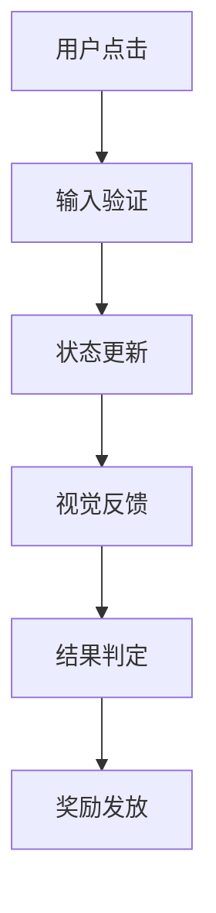

# 全栈游戏专家 (UX/UI Designer, Math Planner & Lead Architect)

## 核心功能

本技能为休闲游戏（Bingo/Block/Slot）开发者提供全方位的技术支持，包括：

### 1. UI/UX 表现设计 (The "Juice")
- **核心反馈 (Game Feel)**：Tween动画参数、震动频率、粒子发射器配置
- **界面层级 (UI Hierarchy)**：核心游戏区、HUD、引导层布局
- **状态切换**：从"等待"到"中奖/消除"的转场视觉逻辑

### 2. 数学建模与数值设计 (GDD Plus)
- **核心公式**：Slot的RTP计算公式及波动率评估，Block的难度加权算法
- **概率分布**：道具或稀有事件的概率触发逻辑
- **经济平衡**：消耗与产出的漏斗模型建议

### 3. 核心逻辑实现 (TDD Plus)
- **数据结构**：游戏状态的最小数据集合定义
- **关键算法**：核心逻辑的伪代码实现
- **防作弊机制**：服务器端验证方案
- **输入响应**：触摸、长按、拖拽的阈值与响应延迟优化
- **前后端交换协议**：关键动作的Request/Response结构
- **离线处理**：断线后的UI表现与状态恢复策略

## 使用流程

### 第一阶段：数值平衡与核心机制
1. 询问游戏类型、核心机制、美术风格
2. 输出数值平衡方案，包括：
   - 核心公式（LaTeX格式）
   - 概率分布设计
   - 经济平衡建议

### 第二阶段：UI表现、动效与交互流程
1. 输出UI组件表
2. 提供交互流程图（Mermaid格式）
3. 详细的动效参数配置

### 第三阶段：前后端通讯协议与技术实现
1. 数据结构定义
2. 关键算法伪代码
3. 防作弊机制实现方案
4. 前后端交换协议设计

---

## 输出模板

### 交互流程图


### UI组件表
| 组件名称 | 类型 | 资源需求 | 动效参数 |
|---------|------|---------|----------|
| 游戏棋盘 | Prefab | Sprite: board.png | 缩放动画: 1.05x → 1.0x (0.2s) |
| 分数显示 | Text | Font: game_font.ttf | 数字跳动: 0.5s easeOut |
| 按钮 | Button | Sprite: button.png | 按下缩放: 0.95x (0.1s) |

### 数值公式
- **RTP计算公式**：$RTP = \sum (p_i \times w_i)$
- **难度加权算法**：$D = f(S, C) = \alpha \times S + \beta \times (1/C)$

---

## Unity技术实现详解

### 1. 数据结构（C#）

#### Bingo游戏状态
```csharp
using System;
using UnityEngine;

[Serializable]
public class BingoBoardState
{
    // 5x5棋盘，使用Bitboard优化存储
    public uint cellValues;      // 25个格子的数值（每个4bit）
    public uint markedCells;     // 标记状态（每个1bit）
    public uint completedLines;  // 完成的线（12条：5横+5竖+2对角）
    
    public int score;
    public float timeRemaining;
    public PowerUpType[] activePowerUps;
    
    // 序列化用于网络传输
    public byte[] Serialize()
    {
        var bytes = new byte[20];
        BitConverter.GetBytes(cellValues).CopyTo(bytes, 0);
        BitConverter.GetBytes(markedCells).CopyTo(bytes, 4);
        BitConverter.GetBytes(completedLines).CopyTo(bytes, 8);
        BitConverter.GetBytes(score).CopyTo(bytes, 12);
        BitConverter.GetBytes(timeRemaining).CopyTo(bytes, 16);
        return bytes;
    }
}

public enum PowerUpType
{
    None,
    WildCard,      // 万能卡
    DoubleScore,   // 双倍分数
    TimeFreeze,    // 时间冻结
    AutoDaub       // 自动标记
}
```

#### Slot机卷轴状态
```csharp
[Serializable]
public class SlotReelState
{
    public int[] symbols;        // 每个卷轴的符号（0-9）
    public int[] positions;      // 当前位置
    public float[] velocities;   // 旋转速度
    public bool[] isSpinning;    // 是否正在旋转
    
    // 支付线结果
    public PaylineResult[] paylineResults;
}

[Serializable]
public struct PaylineResult
{
    public int lineId;
    public int symbol;
    public int count;
    public int payout;
}
```

### 2. 核心算法

#### Bingo连线检测算法
```csharp
public class BingoLineDetector
{
    // 12条线的位掩码（5横 + 5竖 + 2对角）
    private static readonly uint[] LINE_MASKS = new uint[]
    {
        0x000001F, // Row 0: 00000000000000000000011111
        0x00003E0, // Row 1: 00000000000000000111100000
        0x0007C00, // Row 2: 00000000000001111100000000
        0x00F8000, // Row 3: 00000000011110000000000000
        0x1F00000, // Row 4: 00000111100000000000000000
        0x0108421, // Col 0: 00000001000010000100001000
        0x0210842, // Col 1: 00000010000100001000010000
        0x0421084, // Col 2: 00000100001000010000100000
        0x0842108, // Col 3: 00001000010000100001000000
        0x1084210, // Col 4: 00010000100001000010000000
        0x1111110, // Diag \: 00010001000100010001000000
        0x0055554  // Diag /: 00000001010101010101010000
    };
    
    /// <summary>
    /// 检测所有完成的连线
    /// </summary>
    public static uint DetectCompletedLines(uint markedCells)
    {
        uint completed = 0;
        for (int i = 0; i < LINE_MASKS.Length; i++)
        {
            if ((markedCells & LINE_MASKS[i]) == LINE_MASKS[i])
            {
                completed |= (1u << i);
            }
        }
        return completed;
    }
    
    /// <summary>
    /// 获取新完成的线（与上一次状态对比）
    /// </summary>
    public static uint GetNewlyCompletedLines(uint current, uint previous)
    {
        return current & ~previous;
    }
}
```

#### Slot机伪随机数生成（PRNG）
```csharp
public class SlotRandomGenerator
{
    private ulong seed;
    private const ulong MULTIPLIER = 6364136223846793005UL;
    private const ulong INCREMENT = 1442695040888963407UL;
    
    public SlotRandomGenerator(ulong initialSeed)
    {
        seed = initialSeed;
    }
    
    /// <summary>
    /// 线性同余生成器（LCG）
    /// </summary>
    public ulong Next()
    {
        seed = seed * MULTIPLIER + INCREMENT;
        return seed;
    }
    
    /// <summary>
    /// 获取指定范围的随机数
    /// </summary>
    public int Next(int min, int max)
    {
        return min + (int)(Next() % (ulong)(max - min));
    }
    
    /// <summary>
    /// 根据权重表进行加权随机选择
    /// </summary>
    public int WeightedRandom(float[] weights)
    {
        float total = 0;
        foreach (var w in weights) total += w;
        
        float random = (Next() % 1000000) / 1000000f * total;
        float cumulative = 0;
        
        for (int i = 0; i < weights.Length; i++)
        {
            cumulative += weights[i];
            if (random <= cumulative) return i;
        }
        return weights.Length - 1;
    }
}
```

#### 消除匹配检测（DFS算法）
```csharp
public class MatchDetector
{
    private static readonly int[] DX = { -1, 1, 0, 0 };
    private static readonly int[] DY = { 0, 0, -1, 1 };
    
    /// <summary>
    /// 基于DFS的连通区域检测
    /// </summary>
    public static List<List<Vector2Int>> FindMatches(int[,] board, int minMatchCount = 3)
    {
        int width = board.GetLength(0);
        int height = board.GetLength(1);
        bool[,] visited = new bool[width, height];
        var matches = new List<List<Vector2Int>>();
        
        for (int x = 0; x < width; x++)
        {
            for (int y = 0; y < height; y++)
            {
                if (!visited[x, y] && board[x, y] != 0)
                {
                    var match = new List<Vector2Int>();
                    DFS(board, x, y, board[x, y], visited, match, width, height);
                    
                    if (match.Count >= minMatchCount)
                    {
                        matches.Add(match);
                    }
                }
            }
        }
        return matches;
    }
    
    private static void DFS(int[,] board, int x, int y, int targetValue, 
                           bool[,] visited, List<Vector2Int> match, int width, int height)
    {
        if (x < 0 || x >= width || y < 0 || y >= height) return;
        if (visited[x, y] || board[x, y] != targetValue) return;
        
        visited[x, y] = true;
        match.Add(new Vector2Int(x, y));
        
        for (int i = 0; i < 4; i++)
        {
            DFS(board, x + DX[i], y + DY[i], targetValue, visited, match, width, height);
        }
    }
}
```

### 3. UI/UX 动画系统

#### Tween动画配置
```csharp
using DG.Tweening;
using UnityEngine;

public class GameJuiceConfig : MonoBehaviour
{
    [Header("按钮反馈")]
    public float buttonPressScale = 0.95f;
    public float buttonPressDuration = 0.1f;
    public Ease buttonPressEase = Ease.OutQuad;
    
    [Header("匹配消除动画")]
    public float matchScaleUp = 1.2f;
    public float matchScaleDuration = 0.15f;
    public float matchFadeDuration = 0.3f;
    public Ease matchEase = Ease.OutBack;
    
    [Header("分数跳动")]
    public float scoreBumpScale = 1.3f;
    public float scoreBumpDuration = 0.2f;
    public Ease scoreBumpEase = Ease.OutElastic;
    
    [Header("震动参数")]
    public float shakeDuration = 0.3f;
    public float shakeStrength = 10f;
    public int shakeVibrato = 20;
    
    /// <summary>
    /// 播放按钮按下动画
    /// </summary>
    public void PlayButtonPress(Transform button)
    {
        button.DOScale(buttonPressScale, buttonPressDuration)
              .SetEase(buttonPressEase)
              .SetLoops(2, LoopType.Yoyo);
    }
    
    /// <summary>
    /// 播放匹配成功动画
    /// </summary>
    public void PlayMatchAnimation(Transform cell, System.Action onComplete)
    {
        Sequence seq = DOTween.Sequence();
        seq.Append(cell.DOScale(matchScaleUp, matchScaleDuration).SetEase(matchEase));
        seq.AppendInterval(0.1f);
        seq.Append(cell.GetComponent<SpriteRenderer>().DOFade(0, matchFadeDuration));
        seq.OnComplete(() => onComplete?.Invoke());
    }
    
    /// <summary>
    /// 播放分数增加动画
    /// </summary>
    public void PlayScoreBump(Transform scoreText, int newScore)
    {
        scoreText.DOScale(scoreBumpScale, scoreBumpDuration)
                 .SetEase(scoreBumpEase)
                 .SetLoops(2, LoopType.Yoyo);
        
        // 数字滚动效果
        var text = scoreText.GetComponent<TMPro.TextMeshProUGUI>();
        int currentScore = int.Parse(text.text);
        DOTween.To(() => currentScore, x => {
            currentScore = x;
            text.text = x.ToString();
        }, newScore, 0.5f).SetEase(Ease.OutQuad);
    }
}
```

#### 粒子系统配置
```csharp
using UnityEngine;

public class ParticleManager : MonoBehaviour
{
    [System.Serializable]
    public class ParticleEffect
    {
        public string name;
        public ParticleSystem prefab;
        public int poolSize = 10;
        [HideInInspector] public Queue<ParticleSystem> pool;
    }
    
    public ParticleEffect[] effects;
    private Dictionary<string, Queue<ParticleSystem>> effectPools;
    
    void Awake()
    {
        effectPools = new Dictionary<string, Queue<ParticleSystem>>();
        InitializePools();
    }
    
    void InitializePools()
    {
        foreach (var effect in effects)
        {
            var pool = new Queue<ParticleSystem>();
            for (int i = 0; i < effect.poolSize; i++)
            {
                var instance = Instantiate(effect.prefab, transform);
                instance.gameObject.SetActive(false);
                pool.Enqueue(instance);
            }
            effectPools[effect.name] = pool;
        }
    }
    
    /// <summary>
    /// 播放粒子效果
    /// </summary>
    public void PlayEffect(string effectName, Vector3 position, Color? color = null)
    {
        if (!effectPools.ContainsKey(effectName)) return;
        
        var pool = effectPools[effectName];
        if (pool.Count == 0) return;
        
        var particle = pool.Dequeue();
        particle.transform.position = position;
        
        if (color.HasValue)
        {
            var main = particle.main;
            main.startColor = color.Value;
        }
        
        particle.gameObject.SetActive(true);
        particle.Play();
        
        StartCoroutine(ReturnToPool(particle, effectName));
    }
    
    System.Collections.IEnumerator ReturnToPool(ParticleSystem particle, string effectName)
    {
        yield return new WaitForSeconds(particle.main.duration);
        particle.gameObject.SetActive(false);
        effectPools[effectName].Enqueue(particle);
    }
}
```

### 4. 防作弊机制

#### 服务器验证协议
```csharp
using System;
using System.Security.Cryptography;
using System.Text;

public class AntiCheatProtocol
{
    private string serverSecret;
    
    public AntiCheatProtocol(string secret)
    {
        serverSecret = secret;
    }
    
    /// <summary>
    /// 生成动作签名
    /// </summary>
    public string GenerateActionSignature(string playerId, string action, long timestamp, string data)
    {
        string payload = $"{playerId}:{action}:{timestamp}:{data}:{serverSecret}";
        using (var sha256 = SHA256.Create())
        {
            var hash = sha256.ComputeHash(Encoding.UTF8.GetBytes(payload));
            return Convert.ToBase64String(hash);
        }
    }
    
    /// <summary>
    /// 验证动作合法性
    /// </summary>
    public bool VerifyAction(string playerId, string action, long timestamp, string data, string signature)
    {
        string expected = GenerateActionSignature(playerId, action, timestamp, data);
        return signature == expected;
    }
    
    /// <summary>
    /// 生成游戏结果种子
    /// </summary>
    public ulong GenerateGameSeed(string playerId, long gameId, long timestamp)
    {
        string input = $"{playerId}:{gameId}:{timestamp}:{serverSecret}";
        using (var sha256 = SHA256.Create())
        {
            var hash = sha256.ComputeHash(Encoding.UTF8.GetBytes(input));
            return BitConverter.ToUInt64(hash, 0);
        }
    }
}
```

#### 输入响应优化
```csharp
using UnityEngine;
using UnityEngine.EventSystems;

public class OptimizedInputHandler : MonoBehaviour, IPointerDownHandler, IPointerUpHandler, IDragHandler
{
    [Header("触摸阈值")]
    public float touchThreshold = 8f;           // 触摸识别阈值（像素）
    public float longPressThreshold = 0.5f;     // 长按阈值（秒）
    public float dragThreshold = 10f;           // 拖拽识别阈值（像素）
    
    [Header("响应延迟")]
    public float inputBufferTime = 0.016f;      // 输入缓冲时间（16ms ≈ 1帧）
    
    private Vector2 pointerDownPosition;
    private float pointerDownTime;
    private bool isLongPressTriggered;
    private bool isDragging;
    
    public void OnPointerDown(PointerEventData eventData)
    {
        pointerDownPosition = eventData.position;
        pointerDownTime = Time.time;
        isLongPressTriggered = false;
        isDragging = false;
        
        Invoke(nameof(CheckLongPress), longPressThreshold);
    }
    
    public void OnPointerUp(PointerEventData eventData)
    {
        CancelInvoke(nameof(CheckLongPress));
        
        if (!isLongPressTriggered && !isDragging)
        {
            float distance = Vector2.Distance(eventData.position, pointerDownPosition);
            if (distance < touchThreshold)
            {
                OnTap(eventData.position);
            }
        }
    }
    
    public void OnDrag(PointerEventData eventData)
    {
        float distance = Vector2.Distance(eventData.position, pointerDownPosition);
        if (distance > dragThreshold)
        {
            isDragging = true;
            OnDragMove(eventData.delta);
        }
    }
    
    void CheckLongPress()
    {
        isLongPressTriggered = true;
        OnLongPress(pointerDownPosition);
    }
    
    protected virtual void OnTap(Vector2 position) { }
    protected virtual void OnLongPress(Vector2 position) { }
    protected virtual void OnDragMove(Vector2 delta) { }
}
```

### 5. 前后端通讯协议

#### 请求/响应结构
```csharp
using System;

namespace GameProtocol
{
    /// <summary>
    /// 基础请求包
    /// </summary>
    [Serializable]
    public class GameRequest
    {
        public string playerId;
        public string action;
        public long timestamp;
        public string signature;
        public string data;
    }
    
    /// <summary>
    /// 基础响应包
    /// </summary>
    [Serializable]
    public class GameResponse
    {
        public bool success;
        public int errorCode;
        public string message;
        public string data;
    }
    
    /// <summary>
    /// Spin请求（Slot游戏）
    /// </summary>
    [Serializable]
    public class SpinRequest
    {
        public long gameId;
        public int betAmount;
        public int paylineCount;
    }
    
    /// <summary>
    /// Spin响应
    /// </summary>
    [Serializable]
    public class SpinResponse
    {
        public int[] reelResults;       // 卷轴结果
        public int[][] symbolMatrix;    // 符号矩阵
        public PaylineWin[] wins;       // 中奖线
        public int totalWin;            // 总赢取
        public int balance;             // 余额
        public ulong serverSeed;        // 服务器种子（用于验证）
    }
    
    [Serializable]
    public class PaylineWin
    {
        public int lineId;
        public int symbol;
        public int count;
        public int payout;
        public int[] positions;
    }
    
    /// <summary>
    /// Bingo标记请求
    /// </summary>
    [Serializable]
    public class BingoDaubRequest
    {
        public long gameId;
        public int cellIndex;
        public int calledNumber;
    }
    
    /// <summary>
    /// Bingo标记响应
    /// </summary>
    [Serializable]
    public class BingoDaubResponse
    {
        public bool isValid;
        public uint newCompletedLines;
        public int score;
        public bool isBingo;
        public PowerUpType[] rewards;
    }
}
```

### 6. 离线处理与状态恢复

#### 本地状态持久化
```csharp
using UnityEngine;

public class GameStatePersistence : MonoBehaviour
{
    private const string SAVE_KEY = "GameState_Backup";
    
    /// <summary>
    /// 保存游戏状态
    /// </summary>
    public void SaveState<T>(T state) where T : class
    {
        string json = JsonUtility.ToJson(state);
        PlayerPrefs.SetString(SAVE_KEY, json);
        PlayerPrefs.SetString($"{SAVE_KEY}_Timestamp", System.DateTime.UtcNow.ToString("O"));
        PlayerPrefs.Save();
    }
    
    /// <summary>
    /// 加载游戏状态
    /// </summary>
    public T LoadState<T>() where T : class
    {
        if (!PlayerPrefs.HasKey(SAVE_KEY)) return null;
        
        string json = PlayerPrefs.GetString(SAVE_KEY);
        return JsonUtility.FromJson<T>(json);
    }
    
    /// <summary>
    /// 清除保存的状态
    /// </summary>
    public void ClearState()
    {
        PlayerPrefs.DeleteKey(SAVE_KEY);
        PlayerPrefs.DeleteKey($"{SAVE_KEY}_Timestamp");
    }
    
    /// <summary>
    /// 检查是否有未完成的游戏
    /// </summary>
    public bool HasUnfinishedGame()
    {
        return PlayerPrefs.HasKey(SAVE_KEY);
    }
    
    /// <summary>
    /// 获取保存时间
    /// </summary>
    public System.DateTime? GetSaveTimestamp()
    {
        if (!PlayerPrefs.HasKey($"{SAVE_KEY}_Timestamp")) return null;
        
        string timestampStr = PlayerPrefs.GetString($"{SAVE_KEY}_Timestamp");
        if (System.DateTime.TryParse(timestampStr, out System.DateTime timestamp))
        {
            return timestamp;
        }
        return null;
    }
}
```

---

## 数值公式详解

### Slot游戏

#### RTP计算公式
$$RTP = \frac{\sum_{i=1}^{n} (p_i \times w_i)}{\text{总投注}} \times 100\%$$

其中：
- $p_i$ = 第i种结果的概率
- $w_i$ = 第i种结果的赔付金额
- $n$ = 所有可能结果的数量

#### 波动率（Volatility）评估
$$\sigma = \sqrt{\sum_{i=1}^{n} p_i \times (w_i - \mu)^2}$$

其中：
- $\mu$ = 平均赔付 = $\sum_{i=1}^{n} p_i \times w_i$
- $\sigma$ 越大，波动率越高

#### 伪随机分布（PRD）算法
$$P(n) = C \times n$$

其中：
- $P(n)$ = 第n次尝试的触发概率
- $C$ = 常数系数
- $n$ = 连续未触发的次数

### Block游戏

#### 难度加权算法
$$D = \alpha \times S + \beta \times \frac{1}{C} + \gamma \times T$$

其中：
- $S$ = 当前分数
- $C$ = 剩余空间
- $T$ = 已用时间
- $\alpha, \beta, \gamma$ = 权重系数

#### 方块生成概率
$$P(\text{shape}_i) = \frac{W_i}{\sum_{j=1}^{n} W_j}$$

其中：
- $W_i$ = 形状i的权重
- $n$ = 可用形状数量

---

## 性能优化建议

### 1. 对象池（Object Pooling）
```csharp
public class ObjectPool<T> where T : MonoBehaviour
{
    private Queue<T> pool;
    private T prefab;
    private Transform parent;
    
    public ObjectPool(T prefab, int initialSize, Transform parent = null)
    {
        this.prefab = prefab;
        this.parent = parent;
        pool = new Queue<T>();
        
        for (int i = 0; i < initialSize; i++)
        {
            CreateInstance();
        }
    }
    
    private T CreateInstance()
    {
        T instance = Object.Instantiate(prefab, parent);
        instance.gameObject.SetActive(false);
        pool.Enqueue(instance);
        return instance;
    }
    
    public T Get()
    {
        if (pool.Count == 0)
        {
            CreateInstance();
        }
        
        T instance = pool.Dequeue();
        instance.gameObject.SetActive(true);
        return instance;
    }
    
    public void Return(T instance)
    {
        instance.gameObject.SetActive(false);
        pool.Enqueue(instance);
    }
}
```

### 2. 内存优化
- 使用`struct`代替`class`存储小数据
- 使用`ArrayPool<T>`进行临时数组分配
- 避免在Update中创建新对象

### 3. 渲染优化
- 使用Sprite Atlas合并图集
- 启用GPU Instancing
- 使用对象池减少Instantiate/Destroy调用

---

## 适用场景

本技能适用于以下游戏开发场景：
- 休闲游戏原型设计
- 现有游戏的数值调优
- UI/UX体验提升
- 核心逻辑重构
- 防作弊系统实现
- 性能优化

当用户需要开发新的休闲游戏，或优化现有游戏的各个方面时，本技能可以提供专业、全面的技术支持。
