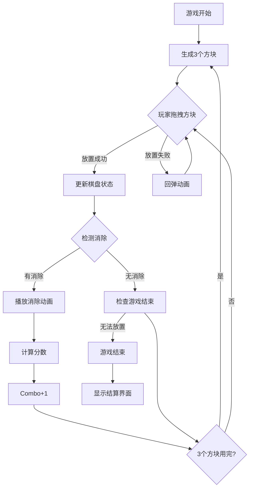

# Block Blast! 游戏设计方案

## 一、游戏概述

### 核心玩法
Block Blast是一款8x8方格的方块拼图消除游戏，玩家需要将下方提供的3个方块拖拽放置到棋盘上，当填满一整行或一整列时，该行/列的方块会被消除并获得分数。游戏目标是尽可能获得高分，直到无法放置新方块为止。

### 游戏特色
- **8x8棋盘**：经典方格布局
- **拖拽放置**：直观的操作方式
- **连击系统**：同时消除多行/列获得Combo奖励
- **策略深度**：需要预留空间给大型方块
- **无尽模式**：挑战最高分数

---

## 二、数值平衡方案

### 2.1 方块生成概率模型

#### 方块类型与权重

| 方块类型 | 形状 | 格子数 | 基础权重 $W_i$ | 说明 |
|---------|------|--------|---------------|------|
| 单格 | ■ | 1 | 15 | 最灵活，高概率 |
| 双格 | ■■ | 2 | 20 | 水平或垂直 |
| 三格直 | ■■■ | 3 | 18 | 水平或垂直 |
| 三格L | ■<br>■■ | 3 | 12 | L形 |
| 四格直 | ■■■■ | 4 | 10 | 水平或垂直 |
| 四格方 | ■■<br>■■ | 4 | 12 | 2x2方块 |
| 四格T | ■■■<br>&nbsp;■ | 4 | 8 | T形 |
| 四格L | ■<br>■<br>■■ | 4 | 8 | 大L形 |
| 五格直 | ■■■■■ | 5 | 5 | 最长方块 |

#### 动态难度调整公式

$$P(\text{shape}_i) = \frac{W_i \times D_{\text{factor}}}{\sum_{j=1}^{n} W_j \times D_{\text{factor}}}$$

其中动态难度系数 $D_{\text{factor}}$ 根据当前游戏状态计算：

$$D_{\text{factor}} = \begin{cases} 
1.5 & \text{if } \text{空格率} > 60\% \\
1.0 & \text{if } 30\% < \text{空格率} \leq 60\% \\
0.6 & \text{if } \text{空格率} \leq 30\%
\end{cases}$$

**空格率计算公式**：
$$\text{空格率} = \frac{\text{空格数}}{64} \times 100\%$$

### 2.2 计分系统

#### 基础分数

| 消除类型 | 基础分数 | 公式 |
|---------|---------|------|
| 单行消除 | 100 | $S_{\text{base}} = 100$ |
| 单列消除 | 100 | $S_{\text{base}} = 100$ |
| 同时消除2行/列 | 250 | $S_{\text{base}} \times 2.5$ |
| 同时消除3行/列 | 450 | $S_{\text{base}} \times 4.5$ |
| 同时消除4行/列 | 700 | $S_{\text{base}} \times 7$ |
| 同时消除5行/列 | 1000 | $S_{\text{base}} \times 10$ |

#### Combo连击奖励

$$S_{\text{total}} = S_{\text{base}} \times (1 + \text{Combo} \times 0.2)$$

| Combo数 | 倍率 | 示例（基础100分） |
|--------|------|------------------|
| 0 | 1.0x | 100 |
| 1 | 1.2x | 120 |
| 2 | 1.4x | 140 |
| 3 | 1.6x | 160 |
| 4+ | 1.8x+ | 180+ |

#### 连击保持机制
- 每次成功放置方块，Combo+1
- 如果放置后没有消除任何行/列，Combo重置为0
- Combo上限为10（最大2.0x倍率）

### 2.3 难度曲线设计

#### 游戏阶段划分

| 阶段 | 分数范围 | 空格率阈值 | 大方块概率 | 特点 |
|------|---------|-----------|-----------|------|
| 新手期 | 0-1000 | >50% | 低 | 学习阶段，简单方块为主 |
| 成长期 | 1000-5000 | 40-60% | 中 | 逐渐引入复杂方块 |
| 挑战期 | 5000-15000 | 30-50% | 高 | 需要策略规划 |
| 大师期 | 15000+ | <40% | 极高 | 高难度挑战 |

#### 自适应难度公式

$$\text{Difficulty} = \alpha \times \frac{\text{CurrentScore}}{1000} + \beta \times (1 - \text{空格率}) + \gamma \times \text{Combo}$$

其中：
- $\alpha = 0.1$（分数权重）
- $\beta = 0.5$（空间权重）
- $\gamma = 0.05$（连击权重）

---

## 三、UI/UX设计方案

### 3.1 交互流程图



### 3.2 UI组件表

#### 核心游戏界面

| 组件名称 | 类型 | 资源需求 | 动效参数 |
|---------|------|---------|----------|
| 游戏棋盘 | Panel | Sprite: board_bg.png (512x512) | 入场: 缩放 0.8→1.0 (0.3s, Ease.OutBack) |
| 格子 | Image | Sprite: cell_empty.png (64x64) | 高亮: 透明度 0.5→1.0 (0.2s) |
| 已占格子 | Image | Sprite: cell_filled.png (64x64) | 消除: 缩放 1.0→1.2→0 (0.3s) |
| 方块预览区 | Panel | Sprite: preview_bg.png | 入场: 从底部滑入 (0.4s) |
| 方块 | Prefab | 根据形状动态生成 | 拖拽: 跟随手指，放大1.1x |
| 分数显示 | Text (TMP) | Font: Bold, 72pt | 更新: 数字滚动 (0.5s) |
| Combo显示 | Text (TMP) | Font: Bold, 48pt, 金色 | 跳动: 缩放 1.0→1.3→1.0 (0.3s) |
| 最高分 | Text (TMP) | Font: Regular, 36pt | 刷新: 闪烁金色 (0.5s) |
| 暂停按钮 | Button | Sprite: btn_pause.png | 按下: 缩放 0.9x (0.1s) |
| 设置按钮 | Button | Sprite: btn_settings.png | 按下: 缩放 0.9x (0.1s) |

#### 特效资源

| 特效名称 | 类型 | 参数配置 |
|---------|------|---------|
| 消除粒子 | Particle System | 颜色: 方块同色，数量: 20，生命周期: 0.8s，速度: 100-200 |
| Combo文字 | Animation | 缩放: 1.0→1.5→1.0，旋转: -10°→10°，颜色: 金→橙→金 |
| 分数增加 | Floating Text | 向上飘移 100px，透明度 1→0，持续时间 1s |
| 方块放置 | Tween | 从预览区飞入，时长 0.2s，Ease.OutQuad |
| 方块回弹 | Tween | 回到原位置，弹性效果，Ease.OutElastic |
| 游戏结束 | Screen Fade | 灰度渐变，时长 0.5s |

### 3.3 动画参数详细配置

#### 方块拖拽动画
```csharp
// 拖拽开始
block.DOScale(1.1f, 0.1f).SetEase(Ease.OutQuad);
block.GetComponent<CanvasGroup>().DOFade(0.8f, 0.1f);

// 拖拽中（每帧更新位置）
block.position = Input.mousePosition;

// 有效放置位置高亮
highlightCell.DOColor(Color.green, 0.1f);

// 拖拽结束（放置成功）
block.DOScale(1.0f, 0.15f).SetEase(Ease.OutBack);
block.GetComponent<CanvasGroup>().DOFade(1f, 0.1f);

// 拖拽结束（放置失败 - 回弹）
block.DOMove(originalPosition, 0.3f).SetEase(Ease.OutElastic);
block.DOScale(1.0f, 0.2f);
```

#### 消除动画序列
```csharp
Sequence eliminateSeq = DOTween.Sequence();

// 1. 格子高亮闪烁
eliminateSeq.Append(cell.DOColor(Color.white, 0.1f).SetLoops(2, LoopType.Yoyo));

// 2. 缩放弹出
eliminateSeq.Append(cell.DOScale(1.2f, 0.15f).SetEase(Ease.OutBack));

// 3. 播放粒子特效
eliminateSeq.AppendCallback(() => PlayParticleEffect(cell.position, cell.color));

// 4. 缩小消失
eliminateSeq.Append(cell.DOScale(0f, 0.2f).SetEase(Ease.InBack));

// 5. 上方方块下落
eliminateSeq.Append(blockAbove.DOMoveY(targetY, 0.3f).SetEase(Ease.OutBounce));
```

#### Combo动画
```csharp
// Combo文字动画
comboText.transform.DOScale(1.5f, 0.2f).SetEase(Ease.OutBack);
comboText.transform.DORotate(new Vector3(0, 0, 10f), 0.1f)
    .SetLoops(2, LoopType.Yoyo);
comboText.DOColor(Color.yellow, 0.1f)
    .SetLoops(2, LoopType.Yoyo);

// 渐出
comboText.DOFade(0f, 0.5f).SetDelay(0.5f);
comboText.transform.DOMoveY(comboText.transform.position.y + 50f, 0.5f)
    .SetDelay(0.5f);
```

### 3.4 界面布局

```
┌─────────────────────────────────────┐
│  [设置]  BLOCK BLAST  [暂停]        │  ← 顶部栏 (80px)
├─────────────────────────────────────┤
│                                     │
│  分数: 12580    最高分: 15800       │  ← 分数区 (100px)
│                                     │
│  ┌─────────────────────────────┐    │
│  │                             │    │
│  │      8x8 游戏棋盘            │    │  ← 棋盘区 (512px)
│  │      (512x512)              │    │
│  │                             │    │
│  └─────────────────────────────┘    │
│                                     │
│        🔥 COMBO x5! 🔥             │  ← Combo显示区 (60px)
│                                     │
│  ┌─────┐  ┌─────┐  ┌─────┐         │
│  │  ■  │  │ ■■  │  │ ■■■ │         │  ← 方块预览区 (200px)
│  │ ■■  │  │ ■■  │  │  ■  │         │
│  └─────┘  └─────┘  └─────┘         │
│                                     │
└─────────────────────────────────────┘
```

---

## 四、核心逻辑实现

### 4.1 数据结构

#### 游戏状态
```csharp
[Serializable]
public class BlockBlastGameState
{
    // 8x8棋盘 (0=空, 1=已占)
    public byte[] board = new byte[64];
    
    // 当前可用的3个方块
    public BlockShape[] availableBlocks = new BlockShape[3];
    
    // 游戏数据
    public int score;
    public int highScore;
    public int combo;
    public int totalMoves;
    public DateTime startTime;
    
    // 序列化
    public string Serialize()
    {
        return JsonUtility.ToJson(this);
    }
}

[Serializable]
public struct BlockShape
{
    public int id;              // 方块类型ID
    public int width;           // 宽度
    public int height;          // 高度
    public byte[] cells;        // 形状数据 (1=有方块, 0=空)
    public Color color;         // 方块颜色
    
    // 预定义形状
    public static BlockShape CreateSingle() => new BlockShape 
    { 
        id = 1, width = 1, height = 1, 
        cells = new byte[] { 1 },
        color = Color.red 
    };
    
    public static BlockShape CreateDouble() => new BlockShape 
    { 
        id = 2, width = 2, height = 1, 
        cells = new byte[] { 1, 1 },
        color = Color.blue 
    };
    
    public static BlockShape CreateSquare() => new BlockShape 
    { 
        id = 6, width = 2, height = 2, 
        cells = new byte[] { 1, 1, 1, 1 },
        color = Color.yellow 
    };
    
    // 更多形状...
}
```

### 4.2 核心算法

#### 棋盘管理
```csharp
public class BoardManager
{
    private byte[] board = new byte[64];
    
    /// <summary>
    /// 检查方块是否可以放置在指定位置
    /// </summary>
    public bool CanPlaceBlock(BlockShape block, int x, int y)
    {
        for (int by = 0; by < block.height; by++)
        {
            for (int bx = 0; bx < block.width; bx++)
            {
                int boardX = x + bx;
                int boardY = y + by;
                
                // 检查边界
                if (boardX < 0 || boardX >= 8 || boardY < 0 || boardY >= 8)
                    return false;
                
                // 检查重叠
                int boardIndex = boardY * 8 + boardX;
                int blockIndex = by * block.width + bx;
                
                if (block.cells[blockIndex] == 1 && board[boardIndex] == 1)
                    return false;
            }
        }
        return true;
    }
    
    /// <summary>
    /// 放置方块到棋盘
    /// </summary>
    public void PlaceBlock(BlockShape block, int x, int y)
    {
        for (int by = 0; by < block.height; by++)
        {
            for (int bx = 0; bx < block.width; bx++)
            {
                int boardIndex = (y + by) * 8 + (x + bx);
                int blockIndex = by * block.width + bx;
                
                if (block.cells[blockIndex] == 1)
                {
                    board[boardIndex] = 1;
                }
            }
        }
    }
    
    /// <summary>
    /// 检测并消除完整的行和列
    /// </summary>
    public EliminationResult CheckElimination()
    {
        var result = new EliminationResult();
        
        // 检测行
        for (int y = 0; y < 8; y++)
        {
            bool isRowFull = true;
            for (int x = 0; x < 8; x++)
            {
                if (board[y * 8 + x] == 0)
                {
                    isRowFull = false;
                    break;
                }
            }
            
            if (isRowFull)
            {
                result.rows.Add(y);
            }
        }
        
        // 检测列
        for (int x = 0; x < 8; x++)
        {
            bool isColFull = true;
            for (int y = 0; y < 8; y++)
            {
                if (board[y * 8 + x] == 0)
                {
                    isColFull = false;
                    break;
                }
            }
            
            if (isColFull)
            {
                result.columns.Add(x);
            }
        }
        
        return result;
    }
    
    /// <summary>
    /// 执行消除
    /// </summary>
    public void Eliminate(EliminationResult result)
    {
        // 消除行
        foreach (int row in result.rows)
        {
            for (int x = 0; x < 8; x++)
            {
                board[row * 8 + x] = 0;
            }
        }
        
        // 消除列
        foreach (int col in result.columns)
        {
            for (int y = 0; y < 8; y++)
            {
                board[y * 8 + col] = 0;
            }
        }
    }
    
    /// <summary>
    /// 检查游戏是否结束（无法放置任何可用方块）
    /// </summary>
    public bool IsGameOver(BlockShape[] availableBlocks)
    {
        foreach (var block in availableBlocks)
        {
            if (CanPlaceBlockAnywhere(block))
                return false;
        }
        return true;
    }
    
    /// <summary>
    /// 检查方块是否可以放置在棋盘上任意位置
    /// </summary>
    private bool CanPlaceBlockAnywhere(BlockShape block)
    {
        for (int y = 0; y <= 8 - block.height; y++)
        {
            for (int x = 0; x <= 8 - block.width; x++)
            {
                if (CanPlaceBlock(block, x, y))
                    return true;
            }
        }
        return false;
    }
    
    /// <summary>
    /// 计算空格率
    /// </summary>
    public float GetEmptyRate()
    {
        int emptyCount = 0;
        foreach (var cell in board)
        {
            if (cell == 0) emptyCount++;
        }
        return (float)emptyCount / 64f;
    }
}

public class EliminationResult
{
    public List<int> rows = new List<int>();
    public List<int> columns = new List<int>();
    
    public int TotalLines => rows.Count + columns.Count;
    public bool HasElimination => TotalLines > 0;
}
```

#### 方块生成器
```csharp
public class BlockGenerator
{
    private System.Random random = new System.Random();
    
    // 方块类型定义
    private List<BlockShape> blockShapes = new List<BlockShape>
    {
        BlockShape.CreateSingle(),      // 单格
        BlockShape.CreateDouble(),      // 双格
        BlockShape.CreateTriple(),      // 三格
        BlockShape.CreateLShape(),      // L形
        BlockShape.CreateSquare(),      // 2x2
        BlockShape.CreateTShape(),      // T形
        BlockShape.CreateLong(),        // 四格直
        BlockShape.CreateFive(),        // 五格
    };
    
    /// <summary>
    /// 根据当前游戏状态生成3个方块
    /// </summary>
    public BlockShape[] GenerateBlocks(float emptyRate, int currentScore)
    {
        var blocks = new BlockShape[3];
        
        // 根据空格率调整难度
        float difficultyFactor = GetDifficultyFactor(emptyRate);
        
        for (int i = 0; i < 3; i++)
        {
            blocks[i] = GenerateSingleBlock(difficultyFactor, currentScore);
        }
        
        return blocks;
    }
    
    /// <summary>
    /// 获取难度系数
    /// </summary>
    private float GetDifficultyFactor(float emptyRate)
    {
        if (emptyRate > 0.6f) return 1.5f;  // 空格多，增加大方块
        if (emptyRate > 0.3f) return 1.0f;  // 正常
        return 0.6f;                         // 空格少，减少大方块
    }
    
    /// <summary>
    /// 生成单个方块
    /// </summary>
    private BlockShape GenerateSingleBlock(float difficultyFactor, int currentScore)
    {
        // 计算每个方块的权重
        var weights = new List<float>();
        
        foreach (var shape in blockShapes)
        {
            float weight = GetBaseWeight(shape);
            
            // 根据难度调整
            if (shape.cells.Length >= 4) // 大方块
            {
                weight *= difficultyFactor;
            }
            else // 小方块
            {
                weight *= (2f - difficultyFactor);
            }
            
            weights.Add(weight);
        }
        
        // 加权随机选择
        int selectedIndex = WeightedRandom(weights);
        return blockShapes[selectedIndex];
    }
    
    /// <summary>
    /// 获取基础权重
    /// </summary>
    private float GetBaseWeight(BlockShape shape)
    {
        return shape.id switch
        {
            1 => 15f,  // 单格
            2 => 20f,  // 双格
            3 => 18f,  // 三格直
            4 => 12f,  // 三格L
            5 => 10f,  // 四格直
            6 => 12f,  // 2x2
            7 => 8f,   // T形
            8 => 8f,   // 大L
            9 => 5f,   // 五格
            _ => 10f
        };
    }
    
    /// <summary>
    /// 加权随机选择
    /// </summary>
    private int WeightedRandom(List<float> weights)
    {
        float total = 0;
        foreach (var w in weights) total += w;
        
        float randomValue = (float)(random.NextDouble() * total);
        float cumulative = 0;
        
        for (int i = 0; i < weights.Count; i++)
        {
            cumulative += weights[i];
            if (randomValue <= cumulative)
                return i;
        }
        
        return weights.Count - 1;
    }
}
```

#### 计分系统
```csharp
public class ScoreManager
{
    public int CurrentScore { get; private set; }
    public int HighScore { get; private set; }
    public int CurrentCombo { get; private set; }
    
    // 基础分数表
    private readonly int[] baseScores = { 0, 100, 250, 450, 700, 1000 };
    
    /// <summary>
    /// 计算消除分数
    /// </summary>
    public int CalculateScore(int linesEliminated, int combo)
    {
        if (linesEliminated <= 0) return 0;
        
        // 基础分数
        int baseScore = linesEliminated < baseScores.Length 
            ? baseScores[linesEliminated] 
            : baseScores[baseScores.Length - 1];
        
        // Combo倍率
        float comboMultiplier = 1f + combo * 0.2f;
        comboMultiplier = Mathf.Min(comboMultiplier, 2f); // 上限2.0x
        
        return Mathf.RoundToInt(baseScore * comboMultiplier);
    }
    
    /// <summary>
    /// 添加分数
    /// </summary>
    public void AddScore(int linesEliminated)
    {
        if (linesEliminated > 0)
        {
            CurrentCombo++;
            int score = CalculateScore(linesEliminated, CurrentCombo);
            CurrentScore += score;
            
            // 更新最高分
            if (CurrentScore > HighScore)
            {
                HighScore = CurrentScore;
            }
        }
        else
        {
            CurrentCombo = 0;
        }
    }
    
    /// <summary>
    /// 重置游戏
    /// </summary>
    public void Reset()
    {
        CurrentScore = 0;
        CurrentCombo = 0;
    }
}
```

### 4.3 输入处理
```csharp
public class BlockDragHandler : MonoBehaviour, IBeginDragHandler, IDragHandler, IEndDragHandler
{
    private RectTransform rectTransform;
    private Canvas canvas;
    private CanvasGroup canvasGroup;
    private Vector2 originalPosition;
    private BlockShape blockShape;
    
    [Header("拖拽设置")]
    public float dragScale = 1.1f;
    public float dragAlpha = 0.8f;
    
    void Awake()
    {
        rectTransform = GetComponent<RectTransform>();
        canvas = GetComponentInParent<Canvas>();
        canvasGroup = GetComponent<CanvasGroup>();
        originalPosition = rectTransform.anchoredPosition;
    }
    
    public void OnBeginDrag(PointerEventData eventData)
    {
        // 放大并降低透明度
        rectTransform.DOScale(dragScale, 0.1f);
        canvasGroup.DOFade(dragAlpha, 0.1f);
        
        // 置于最上层
        canvasGroup.blocksRaycasts = false;
        
        // 通知游戏管理器开始拖拽
        GameManager.Instance.OnBeginDragBlock(this, blockShape);
    }
    
    public void OnDrag(PointerEventData eventData)
    {
        // 跟随鼠标/手指
        RectTransformUtility.ScreenPointToLocalPointInRectangle(
            canvas.transform as RectTransform,
            eventData.position,
            canvas.worldCamera,
            out Vector2 localPoint
        );
        
        rectTransform.anchoredPosition = localPoint;
        
        // 检测悬停的格子并高亮
        GameManager.Instance.OnDragBlock(eventData.position);
    }
    
    public void OnEndDrag(PointerEventData eventData)
    {
        // 恢复透明度
        canvasGroup.DOFade(1f, 0.1f);
        canvasGroup.blocksRaycasts = true;
        
        // 尝试放置
        bool placed = GameManager.Instance.TryPlaceBlock(eventData.position, blockShape);
        
        if (placed)
        {
            // 放置成功，隐藏方块
            gameObject.SetActive(false);
        }
        else
n        {
            // 放置失败，回弹
            rectTransform.DOScale(1f, 0.2f);
            rectTransform.DOAnchorPos(originalPosition, 0.3f)
                .SetEase(Ease.OutElastic);
        }
    }
}
```

---

## 五、游戏流程控制

```csharp
public class GameManager : MonoBehaviour
{
    [Header("组件引用")]
    public BoardManager boardManager;
    public BlockGenerator blockGenerator;
    public ScoreManager scoreManager;
    public UIManager uiManager;
    
    [Header("游戏状态")]
    public GameState currentState;
    private BlockShape[] availableBlocks = new BlockShape[3];
    private int currentBlockIndex = -1;
    
    public enum GameState
    {
        Idle,
        Dragging,
        Placing,
        Eliminating,
        GameOver
    }
    
    void Start()
    {
        StartNewGame();
    }
    
    /// <summary>
    /// 开始新游戏
    /// </summary>
    public void StartNewGame()
    {
        // 重置数据
        scoreManager.Reset();
        boardManager.ClearBoard();
        
        // 生成初始方块
        GenerateNewBlocks();
        
        currentState = GameState.Idle;
    }
    
    /// <summary>
    /// 生成新方块
    /// </summary>
    void GenerateNewBlocks()
    {
        float emptyRate = boardManager.GetEmptyRate();
        availableBlocks = blockGenerator.GenerateBlocks(emptyRate, scoreManager.CurrentScore);
        
        // 更新UI
        uiManager.UpdateBlockPreviews(availableBlocks);
    }
    
    /// <summary>
    /// 尝试放置方块
    /// </summary>
    public bool TryPlaceBlock(Vector2 screenPosition, BlockShape block)
    {
        // 转换屏幕坐标到棋盘坐标
        Vector2Int boardPos = ScreenToBoardPosition(screenPosition);
        
        // 检查是否可以放置
        if (!boardManager.CanPlaceBlock(block, boardPos.x, boardPos.y))
            return false;
        
        // 放置方块
        currentState = GameState.Placing;
        boardManager.PlaceBlock(block, boardPos.x, boardPos.y);
        
        // 播放放置动画
        uiManager.PlayPlaceAnimation(boardPos, block);
        
        // 检测消除
        StartCoroutine(EliminationSequence());
        
        return true;
    }
    
    /// <summary>
    /// 消除序列
    /// </summary>
    IEnumerator EliminationSequence()
    {
        currentState = GameState.Eliminating;
        
        // 检测消除
        var eliminationResult = boardManager.CheckElimination();
        
        if (eliminationResult.HasElimination)
        {
            // 播放消除动画
            yield return StartCoroutine(uiManager.PlayEliminationAnimation(eliminationResult));
            
            // 执行消除
            boardManager.Eliminate(eliminationResult);
            
            // 计算分数
            scoreManager.AddScore(eliminationResult.TotalLines);
            
            // 更新UI
            uiManager.UpdateScore(scoreManager.CurrentScore, scoreManager.CurrentCombo);
        }
        else
        {
            scoreManager.AddScore(0); // 重置Combo
            uiManager.UpdateCombo(0);
        }
        
        // 检查是否需要生成新方块
        if (AreAllBlocksUsed())
        {
            GenerateNewBlocks();
        }
        
        // 检查游戏结束
        if (boardManager.IsGameOver(availableBlocks))
        {
            GameOver();
        }
        else
        {
            currentState = GameState.Idle;
        }
    }
    
    /// <summary>
    /// 游戏结束
    /// </summary>
    void GameOver()
    {
        currentState = GameState.GameOver;
        uiManager.ShowGameOverScreen(scoreManager.CurrentScore, scoreManager.HighScore);
    }
    
    /// <summary>
    /// 检查所有方块是否已使用
    /// </summary>
    bool AreAllBlocksUsed()
    {
        foreach (var block in availableBlocks)
        {
            if (block.id != 0) return false;
        }
        return true;
    }
    
    /// <summary>
    /// 屏幕坐标转棋盘坐标
    /// </summary>
    Vector2Int ScreenToBoardPosition(Vector2 screenPosition)
    {
        // 实现坐标转换逻辑
        // ...
        return new Vector2Int(0, 0);
    }
}
```

---

## 六、性能优化建议

### 6.1 对象池
```csharp
public class BlockPool : MonoBehaviour
{
    [SerializeField] private GameObject blockPrefab;
    [SerializeField] private int poolSize = 20;
    
    private Queue<GameObject> pool = new Queue<GameObject>();
    
    void Start()
    {
        // 预创建对象
        for (int i = 0; i < poolSize; i++)
        {
            CreateNewBlock();
        }
    }
    
    GameObject CreateNewBlock()
    {
        var block = Instantiate(blockPrefab, transform);
        block.SetActive(false);
        pool.Enqueue(block);
        return block;
    }
    
    public GameObject GetBlock()
    {
        if (pool.Count == 0)
        {
            CreateNewBlock();
        }
        
        var block = pool.Dequeue();
        block.SetActive(true);
        return block;
    }
    
    public void ReturnBlock(GameObject block)
    {
        block.SetActive(false);
        pool.Enqueue(block);
    }
}
```

### 6.2 内存优化
- 使用`byte[]`代替`bool[]`存储棋盘状态
- 方块形状使用`struct`而非`class`
- 避免在Update中创建临时对象
- 使用对象池管理方块实例

### 6.3 渲染优化
- 棋盘格子使用单一材质，通过颜色属性区分
- 使用Sprite Atlas合并UI图集
- 消除动画使用DOTween而非Animator
- 禁用不可见UI的射线检测

---

## 七、总结

本设计方案涵盖了Block Blast游戏的完整开发方案：

1. **数值平衡**：动态难度调整、合理的方块生成概率、激励性的计分系统
2. **UI/UX**：流畅的拖拽交互、爽快的消除反馈、清晰的视觉层级
3. **核心逻辑**：高效的棋盘算法、智能的方块生成、完善的流程控制

该方案可直接用于Unity开发，代码示例均为可直接使用的C#实现。
