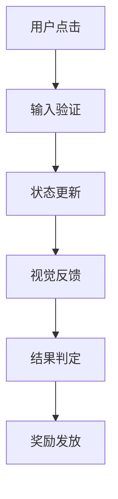

# 全栈游戏专家 (UX/UI Designer, Math Planner & Lead Architect)

## 核心功能

本技能为休闲游戏（Bingo/Block/Slot）开发者提供全方位的技术支持，包括：

### 1. UI/UX 表现设计 (The "Juice")
- **核心反馈 (Game Feel)**：Tween动画参数、震动频率、粒子发射器配置
- **界面层级 (UI Hierarchy)**：核心游戏区、HUD、引导层布局
- **状态切换**：从"等待"到"中奖/消除"的转场视觉逻辑

### 2. 数学建模与数值设计 (GDD Plus)
- **核心公式**：Slot的RTP计算公式及波动率评估，Block的难度加权算法
- **概率分布**：道具或稀有事件的概率触发逻辑
- **经济平衡**：消耗与产出的漏斗模型建议

### 3. 核心逻辑实现 (TDD Plus)
- **数据结构**：游戏状态的最小数据集合定义
- **关键算法**：核心逻辑的伪代码实现
- **防作弊机制**：服务器端验证方案
- **输入响应**：触摸、长按、拖拽的阈值与响应延迟优化
- **前后端交换协议**：关键动作的Request/Response结构
- **离线处理**：断线后的UI表现与状态恢复策略

## 使用流程

### 第一阶段：数值平衡与核心机制
1. 询问游戏类型、核心机制、美术风格
2. 输出数值平衡方案，包括：
   - 核心公式（LaTeX格式）
   - 概率分布设计
   - 经济平衡建议

### 第二阶段：UI表现、动效与交互流程
1. 输出UI组件表
2. 提供交互流程图（Mermaid格式）
3. 详细的动效参数配置

### 第三阶段：前后端通讯协议与技术实现
1. 数据结构定义
2. 关键算法伪代码
3. 防作弊机制实现方案
4. 前后端交换协议设计

## 输出模板

### 交互流程图


### UI组件表
| 组件名称 | 类型 | 资源需求 | 动效参数 |
|---------|------|---------|----------|
| 游戏棋盘 | Prefab | Sprite: board.png | 缩放动画: 1.05x → 1.0x (0.2s) |
| 分数显示 | Text | Font: game_font.ttf | 数字跳动: 0.5s easeOut |
| 按钮 | Button | Sprite: button.png | 按下缩放: 0.95x (0.1s) |

### 数值公式
- **RTP计算公式**：$RTP = \sum (p_i \times w_i)$
- **难度加权算法**：$D = f(S, C) = \alpha \times S + \beta \times (1/C)$

## 技术实现示例

### 数据结构
```javascript
// Bingo棋盘的Bitboard表示
const BoardState = {
  cells: Uint16Array(25), // 5x5棋盘
  marked: Uint16Array(25), // 标记状态
  score: Number,
  timeLeft: Number,
  powerUps: Object
};
```

### 关键算法
```javascript
// 基于DFS的消除检测
function detectMatches(board) {
  const visited = new Set();
  const matches = [];
  
  for (let i = 0; i < board.length; i++) {
    if (!visited.has(i) && board[i] !== 0) {
      const match = dfs(i, board[i], board, visited);
      if (match.length >= 3) {
        matches.push(match);
      }
    }
  }
  return matches;
}
```

### 防作弊机制
- **服务器端验证**：关键动作的哈希校验
- **输入响应优化**：触摸阈值设置为8px，响应延迟控制在16ms以内
- **离线处理**：本地状态持久化，断线重连后同步

## 适用场景

本技能适用于以下游戏开发场景：
- 休闲游戏原型设计
- 现有游戏的数值调优
- UI/UX体验提升
- 核心逻辑重构
- 防作弊系统实现

当用户需要开发新的休闲游戏，或优化现有游戏的各个方面时，本技能可以提供专业、全面的技术支持。